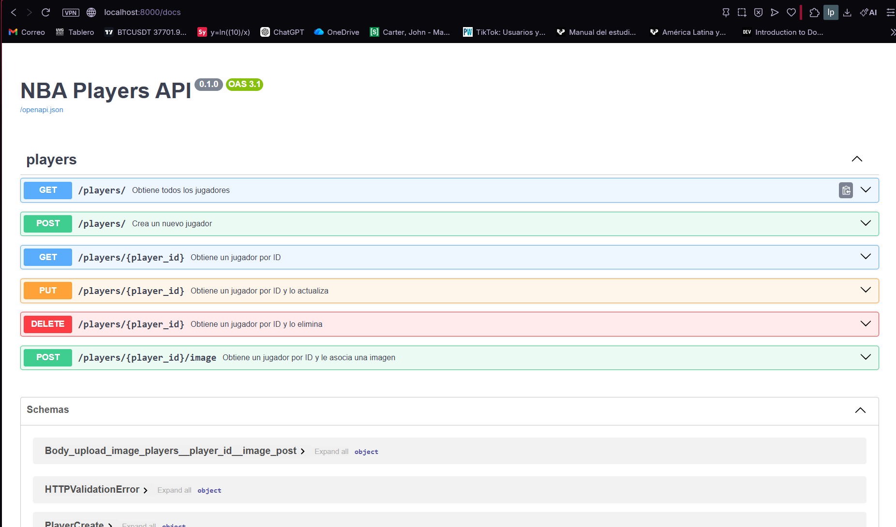
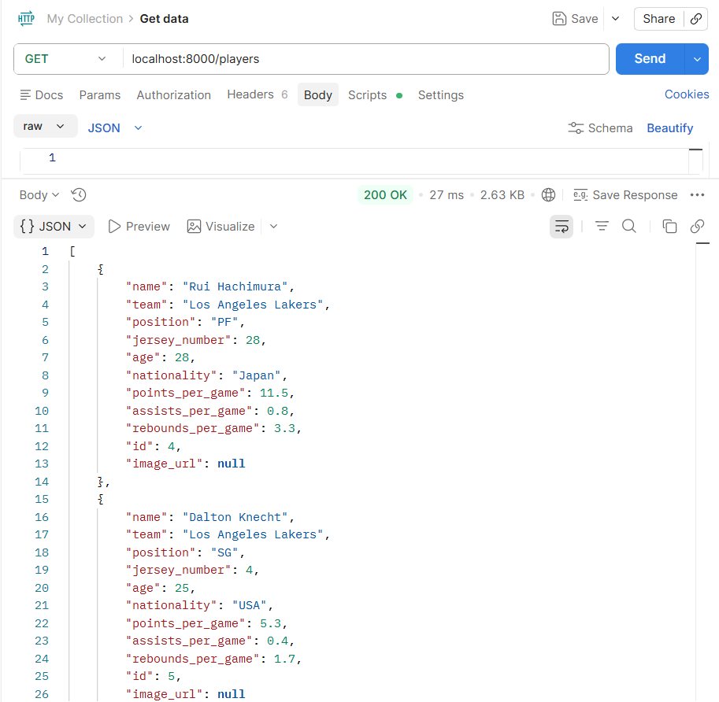

# NBA Players API

Backend del Proyecto 2 de Web. Esta API REST permite administrar jugadores de la NBA y guardar la informacion en una base de datos PostgreSQL. El servidor solo responde JSON y no genera HTML; el frontend se comunica con este backend usando `fetch()`.

Repositorio del frontend: <https://github.com/LuisPHernandez/frontend_proy1_web>

## Tecnologias usadas

- Python 3.12
- FastAPI
- SQLAlchemy
- PostgreSQL
- Docker y Docker Compose
- Uvicorn

## Requisitos

Para correr el proyecto localmente se necesita:

- Docker Desktop instalado
- Git
- Python 3.12, solo si se quiere correr el seed desde la maquina local

## Como correr el backend localmente

1. Clonar el repositorio:

```bash
git clone https://github.com/LuisPHernandez/backend_proy1_web.git
cd backend_proy1_web
```

2. Crear el archivo `.env` copiando el ejemplo:

```bash
cp .env.example .env
```

3. Levantar PostgreSQL y la API con Docker Compose:

```bash
docker compose up --build
```

4. Revisar que la API este corriendo:

```text
http://localhost:8000
```

5. Abrir la documentacion interactiva de Swagger:

```text
http://localhost:8000/docs
```

6. Opcional: poblar la base de datos con datos de prueba. Con el backend corriendo, instalar dependencias localmente y ejecutar:

```bash
pip install -r requirements.txt
python seed.py
```

## Endpoints principales

La API trabaja con jugadores en la ruta `/players`:

- `GET /players` - lista jugadores. Soporta `page`, `limit`, `q`, `sort` y `order`.
- `GET /players/{player_id}` - obtiene un jugador por ID.
- `POST /players` - crea un jugador.
- `PUT /players/{player_id}` - actualiza un jugador.
- `DELETE /players/{player_id}` - elimina un jugador.
- `POST /players/{player_id}/image` - sube una imagen para el jugador.

## CORS

CORS es una politica de seguridad del navegador que controla si un frontend puede hacer peticiones a un backend que esta en otro origen, por ejemplo otro puerto. En este proyecto se configuro FastAPI con `CORSMiddleware` permitiendo todos los origenes, metodos y headers durante desarrollo.

## Challenges implementados

- Backend REST separado del frontend.
- Base de datos real con PostgreSQL.
- Documentacion OpenAPI generada por FastAPI.
- Swagger UI servido desde el backend en `/docs`.
- Codigos HTTP usados segun la accion: `200`, `201`, `204`, `400`, `404` y `500`.
- Errores en JSON usando `HTTPException`.
- Paginacion en `GET /players` con `page` y `limit`.
- Busqueda por nombre con `q`.
- Ordenamiento con `sort` y `order=asc|desc`.
- Subida de imagenes con `UploadFile` y almacenamiento en la carpeta `uploads`.

## Screenshot





## Reflexion

Me gusto usar FastAPI porque hace bastante facil separar la API del cliente y ademas genera Swagger casi automaticamente. SQLAlchemy tambien ayudo a no escribir SQL directo todo el tiempo, aunque al principio cuesta un poco entender bien donde poner modelos, schemas, repositorios y servicios.

Usaria FastAPI otra vez para un proyecto parecido, especialmente si necesito una API rapida con buena documentacion. PostgreSQL tambien lo volveria a usar porque se siente mas cercano a una aplicacion real que guardar todo en archivos o usar una base muy simple. El challenge de imagenes fue el mas interesante porque obliga a pensar no solo en la base de datos, sino tambien en archivos, tipos permitidos y URLs publicas.
